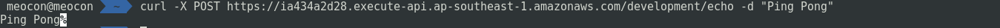
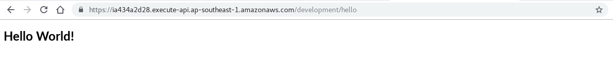
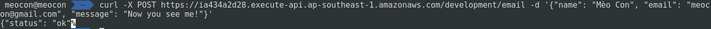
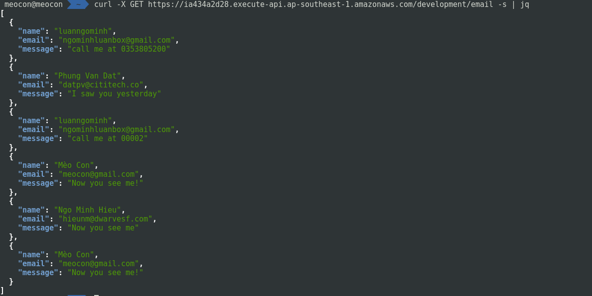

## This is notes and example about serverless
* Configuring AWS credentials: https://docs.aws.amazon.com/cli/latest/userguide/cli-chap-configure.html, this credentials have to has full admin access.
* Deploy cloud function: 
```shell
$ make
$ sls deploy
# Use also can use serverless instead of sls
# sls is serverless's alias
```
### Echo function
```shell
$ curl -X POST https://<your-lambda-address>/development/echo -d "Echo messages"
```

### Hello function
```shell
$ curl -X GET https://<your-lambda-address>/development/hello
```
or try it on browser

### Post contact
```shell
$ curl -X POST https://<your-lambda-address>/development/email -d '{"name": "luanngominh", "email": "ngominhluanbox@gmail.com"}, "message": Call me at +84353805200, thanks!"'
```

### View all contacts
```shell
$ curl -X GET https://<your-lambda-address>/development/email
```
